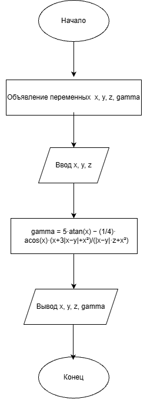

# Домашнее задание к работе 2
## Условие задачи:
Создать программу вычисления указанной величины. Результат проверить при заданных исходных значениях.

Формула:

γ = 5·arctg(x) − (1/4)·arccos(x) · (x + 3|x−y| + x²) / (|x−y|·z + x²)

Исходные значения: x = 0.1722, y = 6.33, z = 3.25×10⁻⁴.

## 1. Алгоритм и блок-схема
### Алгоритм
```
Начало.
Объявить переменные x, y, z, gamma типа double.
Ввести значения x, y, z.
Вычислить значение gamma по формуле.
Вывести результаты расчётов с подстановкой всех значений в текст.
Конец.
```
### Блок-схема


## 2. Реализация программы
```
#define _CRT_SECURE_NO_WARNINGS
#include <stdio.h>
#include <locale.h>
#include <math.h>

int main()
{
    setlocale(LC_ALL, "RUS");

    double x, y, z, gamma;

    printf("Введите x: ");
    scanf("%lf", &x);

    printf("Введите y: ");
    scanf("%lf", &y);

    printf("Введите z: ");
    scanf("%lf", &z);

    gamma = 5 * atan(x) - (1.0 / 4.0) * acos(x) * (x + 3 * fabs(x - y) + x * x) / (fabs(x - y) * z + x * x);

    printf("\n--- Результаты ---\n");
    printf("x = %.4lf\n", x);
    printf("y = %.2lf\n", y);
    printf("z = %.2le\n", z);
    printf("gamma = %.6lf\n", gamma);

    getchar();
    getchar();
    return 0;
}
```
### 3. Результаты работы программы
```
Введите x: 0,1722
Введите y: 6,33
Введите z: 0,000325

--- Результаты ---
x = 0,1722
y = 6,33
z = 3,25e-04
gamma = -205,305571
```
### 4. Информация о разработчике
Дегтярева Полина, бИЦТ-262
